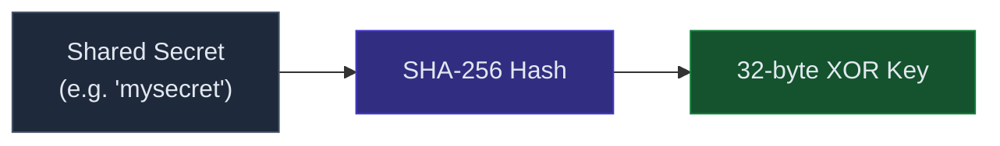
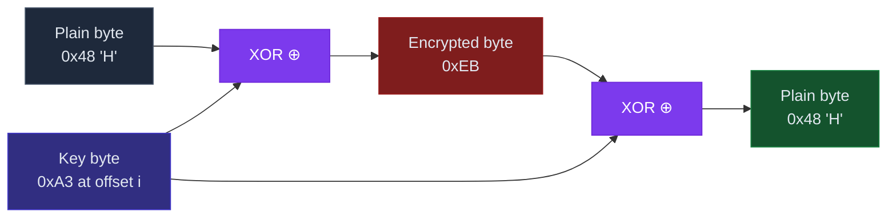
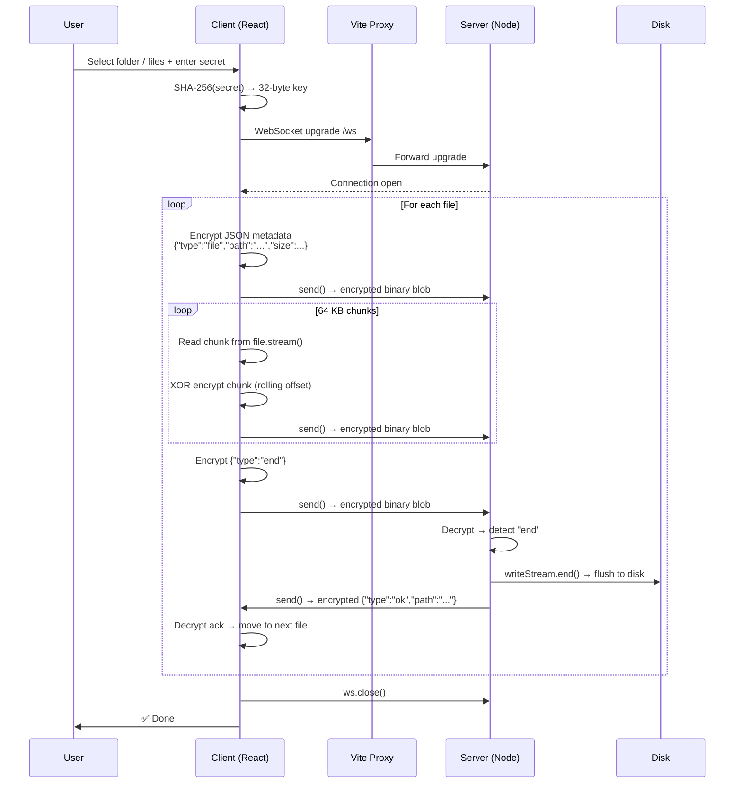
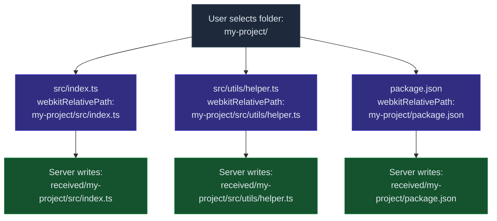
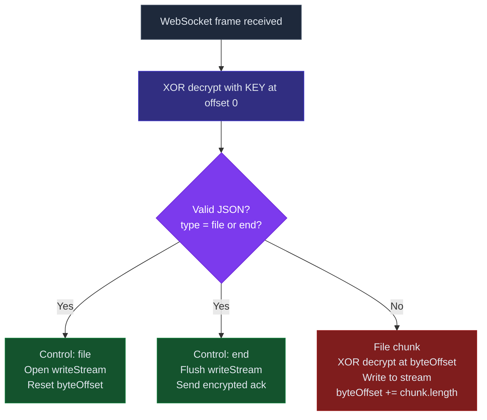

# File Streamer

A encrypted file streaming app — select a folder or files in the browser, and they stream directly to the server over WebSocket, encrypted end-to-end. No plain text ever leaves the client.

---

## Stack

| Side | Tech |
|---|---|
| Client | React + TypeScript (Vite) |
| Server | Node.js + TypeScript (`ws`) |
| Transport | WebSocket |
| Encryption | XOR cipher with SHA-256 derived key |

---

## How It Works

### 1. Key Derivation

Both client and server independently derive the same 32-byte key from the shared secret. They never exchange the key over the wire.



---

### 2. XOR Encryption

Each byte of data is XORed against the key at a rolling offset. XOR is symmetric — the same operation encrypts and decrypts.



---

### 3. Full Stream Flow (per file)



---

### 4. Folder Structure Preservation

The browser's `webkitRelativePath` gives the full relative path of each file inside the selected folder. The server recreates the same tree on disk.



---

### 5. Message Protocol

Every frame sent over WebSocket is an encrypted binary blob — no plain text at any point.



---

## Project Structure

```
file-streamer/
├── client/
│   ├── src/
│   │   ├── App.tsx                    # UI — file picker, progress, status
│   │   └── services/
│   │       └── fileStreamService.ts   # Key derivation, XOR, WS streaming
│   ├── vite.config.ts                 # Proxy /ws → localhost:3001
│   └── package.json
│
└── server/
    ├── src/
    │   └── index.ts                   # WS server, decrypt, write to disk
    ├── received/                      # Streamed files land here
    └── package.json
```

---

## Running

```bash
# 1. Start server
cd server
npm install
SECRET=mysecret npx ts-node src/index.ts

# 2. Start client (separate terminal)
cd client
npm install
npm run dev

# 3. Open http://localhost:5173
#    Enter "mysecret" as the secret
#    Select a folder or files → stream
```

---

## Security Notes

| Property | Detail |
|---|---|
| Encryption | XOR with SHA-256 derived key — simple, not production-grade |
| Key exchange | Never transmitted — both sides derive from shared secret |
| Control frames | Also encrypted — no plain JSON visible on the wire |
| Path traversal | Server strips `../` sequences before writing to disk |
| Upgrade for production | Replace XOR with AES-256-GCM (`SubtleCrypto` / `crypto.createCipheriv`) |