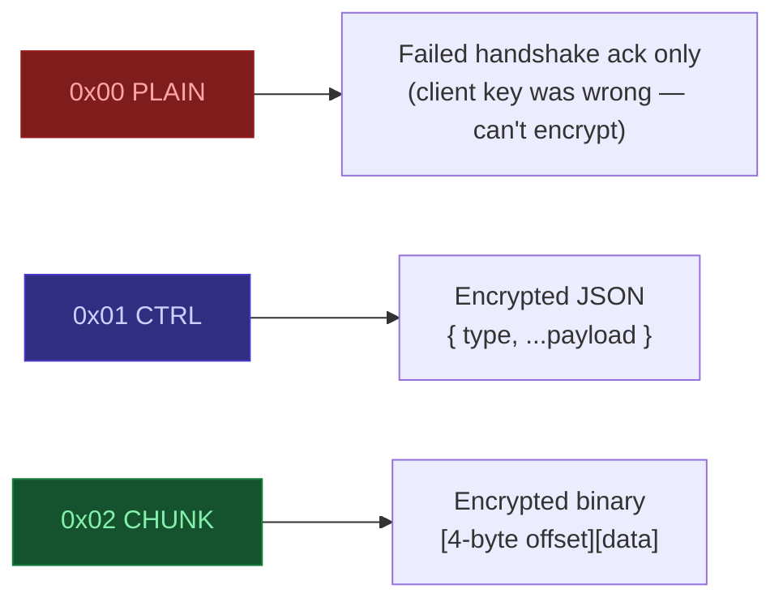
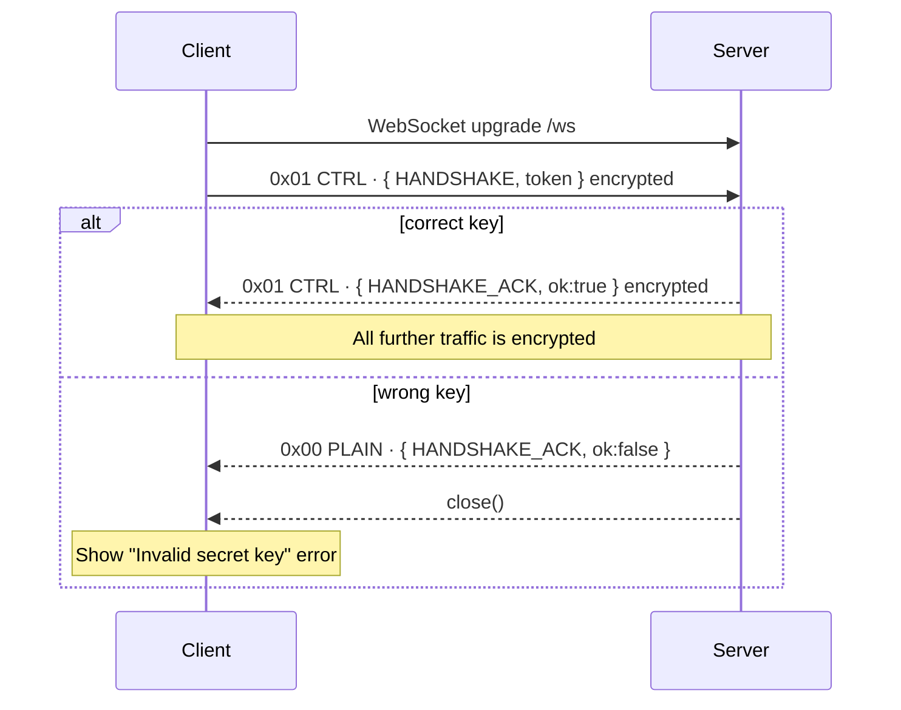
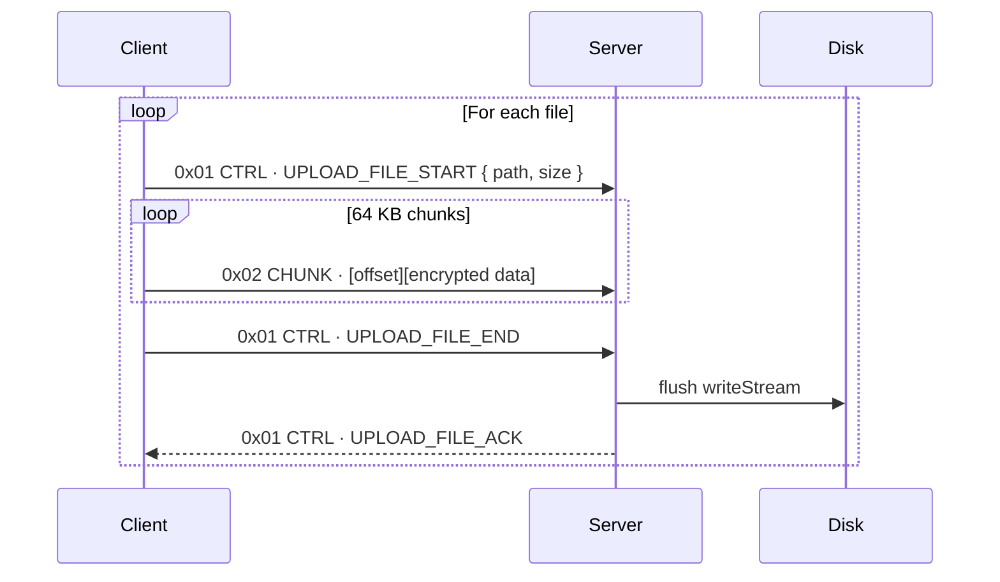
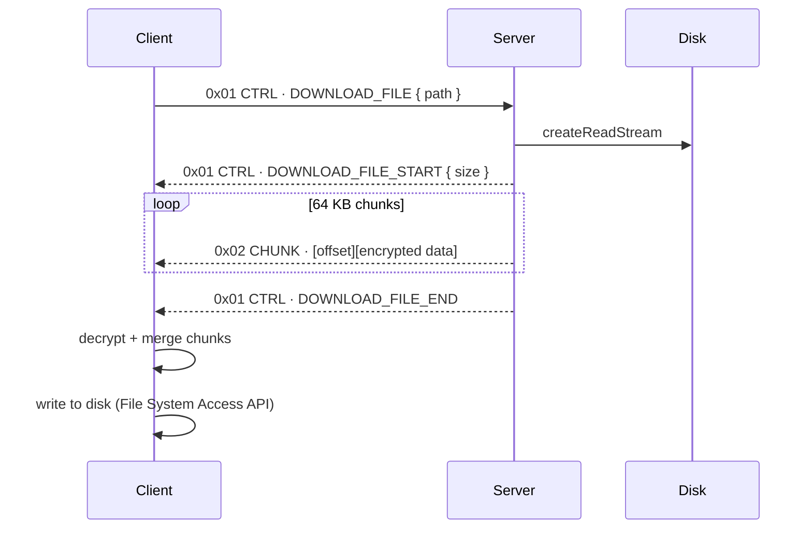
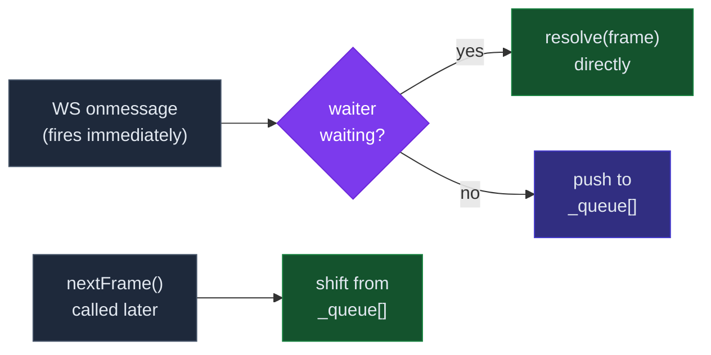
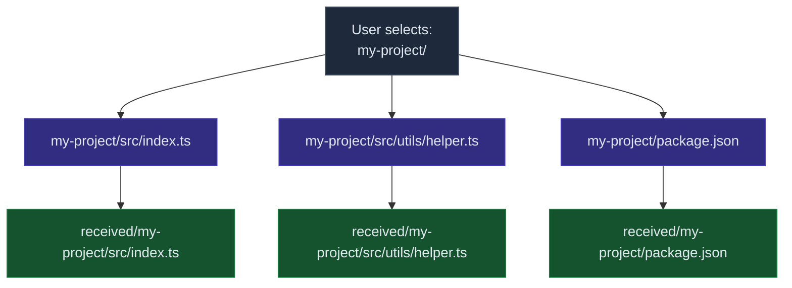

# File Streamer

Stream files from browser to server (and back) over WebSocket — fully encrypted end-to-end. No plain text ever crosses the wire.

---

## Stack

| Side | Tech |
| --- | --- |
| Client | React + TypeScript (Vite) |
| Server | Node.js + TypeScript (`ws`) |
| Transport | WebSocket only |
| Encryption | XOR cipher with SHA-256 derived key |

---

## How It Works

### 1. Key Derivation

Both sides independently derive the same 32-byte key from the shared secret. The key is never sent over the wire.


---

### 2. Frame Protocol

Every WebSocket message starts with a **1-byte prefix** — no ambiguity between control and data frames.



---

### 3. Connection & Handshake



---

### 4. Upload Flow



---

### 5. Download Flow



---

### 6. Message Queue (no dropped frames)

Incoming frames are buffered in a queue the moment they arrive. Consumers pull from it asynchronously — React re-renders never cause frames to be missed.



---

### 7. Folder Structure Preservation

`webkitRelativePath` carries the full relative path of each file. The server recreates the same tree on disk.



---

### 8. Download All — One Folder Picker

When downloading all files, the browser shows **one** folder picker. All files then save silently into the chosen folder with the original subfolder structure restored — no per-file save dialogs.

| Browser | Behavior |
| --- | --- |
| Chrome / Edge 86+ | ✅ One folder picker → silent saves |
| Safari 15.2+ | ✅ One folder picker → silent saves |
| Firefox | ⚠ Falls back to per-file save dialog |

---

## Event Types

| Type | Direction | Purpose |
| --- | --- | --- |
| `HANDSHAKE` | C → S | Initial auth with token |
| `HANDSHAKE_ACK` | S → C | Auth result |
| `LIST_FILES` | C → S | Request file list |
| `FILES_LIST` | S → C | Array of relative paths |
| `UPLOAD_FILE_START` | C → S | Begin file upload `{ path, size }` |
| `UPLOAD_FILE_END` | C → S | File upload complete |
| `UPLOAD_FILE_ACK` | S → C | Server confirmed save |
| `DOWNLOAD_FILE` | C → S | Request a file `{ path }` |
| `DOWNLOAD_FILE_START` | S → C | File incoming `{ size }` |
| `DOWNLOAD_FILE_END` | S → C | File transfer complete |
| `ERROR` | S → C | Error with `{ message }` |

---

## Project Structure

```text
file-streamer/
├── client/
│   ├── src/
│   │   ├── App.tsx                    # UI — key gate, upload tab, download tab
│   │   └── services/
│   │       └── fileStreamService.ts   # Crypto, frame protocol, WS queue
│   ├── vite.config.ts                 # Proxy /ws → localhost:3001
│   └── package.json
│
└── server/
    ├── src/
    │   └── index.ts                   # WS server — handshake, upload, download
    ├── received/                      # Uploaded files land here
    └── package.json
```

---

## Running

crate a `.env` file under `stream-server` add env variables ( refer `.env.sample` )

```bash
# Server
cd stream-server
pnpm install
pnpm run dev

# Client
cd stream-client
pnpm install
pnpm run dev
# Open http://localhost:5173 — enter "mysecret" as the key
```

---

## Security Notes

| Property | Detail |
| --- | --- |
| Encryption | XOR with SHA-256 key — simple, not production-grade |
| Key exchange | Never transmitted — both sides derive independently |
| All frames encrypted | Control messages, chunks, and acks — all XOR'd |
| Path traversal | Server strips `../` before writing to disk |
| Upgrade for production | Replace XOR with AES-256-GCM (`SubtleCrypto` / `crypto.createCipheriv`) |
